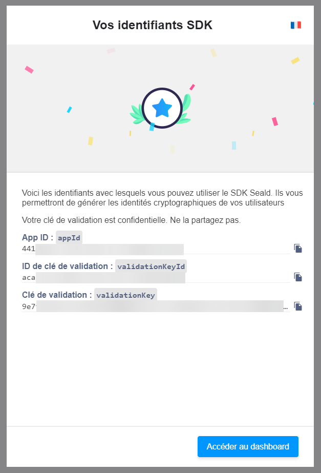
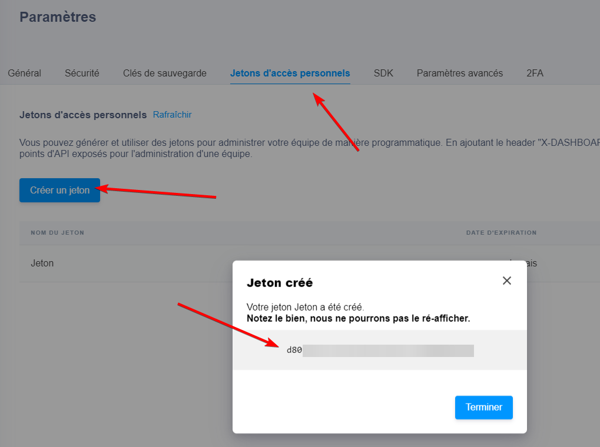

# Construire une application de partage de fichiers chiffrés de bout-en-bout avec Seald

*Si vous voulez directement manipuler le projet final, vous pourrez le trouver sur notre
[dépot Github seald/sdk-upload-example](https://github.com/seald/sdk-upload-example/), avec les instructions pour le
lancer sur Docker. Attention, il s'agit ici d'un projet didactique, venant sans garantie et nécessitant certaines
améliorations pour pouvoir être utilisé en production.*

## Une application de partage de fichiers chiffrés de bout-en-bout

Des applications de partage de fichiers, il en existe énormément (WeTransfer, OneDrive, Dropbox, ...). Cependant,
comment ces plateformes assurent-elles là confidentialité des données qui y transitent ? 

Naïvement, les fichiers sont directement copiés sur les serveurs. Usuellement les mesures de sécurisation mises en
places sont principalement sur le transfert (en utilisant [SSL/TLS pour 
HTTPS](https://www.ssi.gouv.fr/guide/recommandations-de-securite-concernant-lanalyse-des-flux-https/)). Néanmoins,
le fichier, une fois acheminé au serveur est souvent stocké "en clair". Ainsi, un développeur ou administrateur système
pourrait les lire. Mais également une personne malveillante (un hacker par exemple) ayant mis à mal la sécurité de
l'application (cela fait notamment echo à
[la récente vulnérabilité trouvée dans Log4j](https://www.cert.ssi.gouv.fr/alerte/CERTFR-2021-ALE-022/)).

Il existe une technologie qui permet de répondre à cette problématique :
[le chiffrement de bout-en-bout](https://fr.wikipedia.org/wiki/Chiffrement_de_bout_en_bout). Elle permet de sécuriser
cryptographiquement un fichier, afin que seules les personnes autorisées puissent lire les fichiers. Cela passe
par la génération de paires de clés de chiffrement / déchiffrement sur les appareils des utilisateurs,
ce qui peut être une tache très ardue pour un développeur, aussi bien en terme de difficulté que de risque de sécurité.
[Seald SDK](https://www.seald.io/fr) (certifiée par l'ANSSI) permet justement de faire abstraction de cette complexité
et d'utiliser une bibliothèque cryptographique très simplement.

Dans cet article, nous verrons comment implémenter le chiffrement de bout-en-bout dans une application de transfert de
fichiers.

En choix de technologie :

- Coté backend, nous utiliserons [Django](https://www.djangoproject.com) et [django-rest-framework](https://www.django-rest-framework.org) ;
- Coté frontend, nous utiliserons du JavaScript avec [React](https://fr.reactjs.org).

Ce guide est "haut niveau", l'intégralité du code est très simple à transposer dans d'autres langages, tant que la
partie cliente (frontend ici) peut exécuter du JavaScript.

## Cahier des charges de l'application

L'application d'exemple choisie pour ce guide sera donc une page d'envoi / reception de fichiers.

Le workflow de l'application est le suivant :

- Une personne peut s'inscrire sur l'application ;
- Une autre personne (pas nécessairement inscrite) peut envoyer un fichier à un destinataire inscrit ;
- Un utilisateur authentifié peut lister les fichiers qu'il a reçus et les télécharger.

Le développement d'une telle application n'est pas l'objet de ce guide. Nous nous intéresserons uniquement aux
spécificités liées au chiffrement de bout-en-bout des fichiers à leur envoi et à leur téléchargement.

Ainsi à la fin de ce guide :

- L'identité cryptographique d'un utilisateur sera créée à son inscription ;
- Les fichiers transmis au serveur seront chiffrés uniquement pour l'utilisateur destinataire dudit fichier ;
- L'utilisateur destinataire pourra déchiffrer et télécharger ses fichiers.

Le tout, de façon complétement transparente à chaque niveau du workflow initial.

## Création d'un projet sur Seald

Afin de pouvoir utiliser Seald SDK, il faut tout d'abord créer un compte afin de pouvoir générer des clés d'API. Pour
ce faire, il suffit de s'inscrire sur la page de [création de compte](https://www.seald.io/fr/create-sdk). Et
différentes clés d'API seront générées à l'inscription (nous les appellerons `SEALD_APP_ID`, `SEALD_VALIDATION_KEY_ID`
et `SEALD_VALIDATION_KEY`).



Une fois ces clés d'API générées, il est aussi recommandé de générer un jeton d'accès personnel, permettant de manipuler
le dashboard via l'API. Pour ce faire, il faut aller dans les
[paramètres du dashboard](https://dashboard.seald.io/dashboard/#/settings), dans l'onglet "Jetons d'accès personnels",
et d'en créer un.



Ce jeton va permettre de créer un secret partagé entre le backend de notre application et Seald, afin de pouvoir
générer des licences pour les utilisateurs.

Pour générer un secret partagé, il faut utiliser
[la commande fournie dans la documentation](https://docs.seald.io/sdk/guides/9-anonymous-encryption.html#json-web-tokens) : 

```bash
curl -X POST https://dashboard.seald.io/dashboardapi/v2/jwtsharedsecret/ \
  -H 'X-DASHBOARD-API-KEY: VOTRE_JETON_D_ACCES' \
  -H 'Content-Type: application/json' \
  --data-raw '{"permissions": [-1]}'
```

A l'issue de cette commande, nous pouvons récupérer `id` et `shared_secret` (que nous appellerons
`SEALD_JWT_SHARED_SECRET_ID` et `SEALD_JWT_SHARED_SECRET`).

Nous avons donc les clés d'API et jetons suivants:

-  `SEALD_APP_ID`
-  `SEALD_VALIDATION_KEY_ID`
-  `SEALD_VALIDATION_KEY`
-  `SEALD_JWT_SHARED_SECRET_ID`
-  `SEALD_JWT_SHARED_SECRET`

Ils seront nécessaires dans la suite de ce guide.

## Génération d'une identité cryptographique à l'inscription

Lorsque l'on souhaite intégrer du chiffrement de bout-en-bout dans une application, la première chose à faire, dans le
workflow complet, est de générer des clés cryptographiques pour l'utilisateur lors de son inscription.

Ces clés permettent : 

- lorsque l'on souhaite envoyer un document à un utilisateur, à utiliser la partie "publique" de ces clés pour 
sécuriser le document ;
- lorsque l'utilisateur souhaite déchiffrer un document, d'utiliser la partie "privée" de la clé.

La difficulté, lorsque l'on implémente soi-même ces fonctionnalités, est d'intégrer :

- le stockage des clés privées hors du périmètre de l'application ;
- le renouvellement des clés.

L'avantage, en utilisant Seald, est que tous ces mécanismes de sécurité sont installés dans la bibliothèque sans avoir
à se préoccuper de leur implémentation !

L'ensemble de ces clés est appelé une identité cryptographique.

Pour générer l'identité cryptographique, il faut intégrer plusieurs allers-retours entre le backend et le frontend.
Cette génération s'articule schématiquement comme suit :

- Le backend génère un jeton de licence Seald SDK et l'envoie au frontend ;
- Le frontend génère l'identité cryptographique ;
- Le frontend envoie l'identifiant Seald au backend.

### Génération du jeton de licence Seald SDK

Coté backend, pour générer un jeton de licence, nous avons besoin de `SEALD_APP_ID`, `SEALD_VALIDATION_KEY` et
`SEALD_VALIDATION_KEY_ID`.

À partir de ces informations, un [scrypt](https://fr.wikipedia.org/wiki/Scrypt) permet de générer un jeton de
licence.

Ici, nous générons le jeton de licence de l'utilisateur à partir de l'id de l'utilise (`self.id`) en python.

```python
def get_user_license_token(self):
    seald_app_id = os.environ.get("SEALD_APP_ID")
    seald_validation_key = os.environ.get("SEALD_VALIDATION_KEY")
    seald_validation_key_id = os.environ.get("SEALD_VALIDATION_KEY_ID")
    nonce = secrets.token_bytes(32).hex()
    token = hashlib.scrypt(
        f"{self.id}@{seald_app_id}-{seald_validation_key}".encode(),
        salt=nonce.encode(),
        n=16384,
        r=8,
        p=1,
    ).hex()
    return f"{seald_validation_key_id}:{nonce}:{token}"
```

Il suffit donc d'envoyer cette information à l'inscription de l'utilisateur.

### Génération de l'identité cryptographique

A partir du `user_license_token` précédement généré, nous pouvons générer l'identité cryptographique de l'utilisateur
sur le frontend avec le code JavaScript suivant :

```javascript
import SealdSDK from '@seald-io/sdk-web'
import SealdSDKPluginSSKSPassword from '@seald-io/sdk-plugin-ssks-password'

const appId = '{SEALD_APP_ID}'

const  seald = SealdSDK({ appId, plugins: [SealdSDKPluginSSKSPassword()] })

const sealdInitiateIdentity = async (userId, userLicenseToken, password) => {
  await seald.initialize()
  await seald.initiateIdentity({ userId, userLicenseToken })
  await seald.ssksPassword.saveIdentity({ userId, password })
  return (await seald.getCurrentAccountInfo()).sealdId
}
```

A noter que `password` est ici utilisé comme secret pour sécuriser les clés privées de l'utilisateur. En utilisant
directement le mot de passe de l'utilisateur (normalement connu par le frontend à l'inscription ou à la connexion),
le backend et l'identité Seald sont protégés par le même secret. Afin qu'une compromission du backend ne mène pas
à une compromission de l'identité Seald, il conviendra de changer la méthode d'authentification au backend afin
de d'envoyer uniquement une dérivation du mot de passe au backend, et plus le mot de passe tel quel. Cela n'est pas
fait dans ce projet d'initiation. [Des informations à ce sujet sont disponibles sur la documentation de
Seald.](https://docs.seald.io/sdk/example/pre-derivation.html)

### Sauvegarde de l'identifiant Seald

Le backend aura ensuite besoin de l'identifiant Seald de l'utilisateur, afin de permettre aux autres utilisateurs
de retrouver les identités cryptographiques publiques.

Pour cela, deux solutions existent: soit le backend retrouve l'identifiant à partir de l'identité donnée dans le jeton
de licence, soit l'utilisateur l'envoie au backend une fois l'identité créée. C'est ce que nous avons choisi pour ce
guide.

La fonction précedente (`sealdInitiateIdentity`) renvoi le `sealdId`, il suffit donc de l'envoyer au backend :

```javascript
const userUpdateSealdId = async (sealdId) => {
  return fetch(
    '/api/users/update_seald_id/',
    method='POST',
    body=JSON.stringify({seald_id: sealdId}))
}
```

Et de le récupérer sur le backend:

```python
class User(models.Model):
    [...]
    def update_seald_id(self, seald_id):
        self.seald_id = seald_id
        self.save()

class UserView(viewsets.ViewSet):
    [...]
    @action(methods=["POST"], detail=False)
    def update_seald_id(self, request):
        [...]
        user = get_object_or_404(User, django_user=request.user)
        user.update_seald_id(serializer.validated_data["seald_id"])
        return Response([...])
```

## Récupération de l'identité cryptographique à la connexion

Le chapitre précédent permet d'initialiser la variable `seald` avec une création d'identité cryptographique à
l'inscription. Néanmoins, lorsque l'utilisateur se connecte, il est également nécessaire de pouvoir initialiser la
variable `seald`, non pas en créant une identité, mais en récupérant celle créée à l'inscription.

Pour ce faire, il suffit d'ajouter sur le frontend, lors d'une authentification réussie, le chargement de l'identité
cryptographique :

```javascript
const sealdRetrieveIdentity = async (userId, password) => {
  await seald.initialize()
  await seald.ssksPassword.retrieveIdentity({ userId, password })
}
```

Même remarque que précédemment concernant `password`, il est utilisé comme secret pour sécuriser les clés privées de
l'utilisateur. Bien qu'il soit possible d'utiliser directement le mot de passe de l'utilisateur (normalement connu par
le frontend à la connexion), il est recommandé d'utiliser une dérivation (par exemple avec
[PBKDF2](https://fr.wikipedia.org/wiki/PBKDF2)).

Attention cependant. Il est possible, dans de nombreux cas, de ne pas avoir le `password` de disponible au chargement
du frontend :

- Utilisateur déjà authentifié, qui possède une session sur le backend ;
- Application qui n'est pas une SPA ;
- Authentification déportée (ex: OAuth).

Dans ce cas, une solution peut être d'utiliser une base de données locale persistante.
[Des informations à ce sujet sur la documentation de Seald](https://docs.seald.io/sdk/example/localstorage.html)

## Chiffrement d'un fichier à l'envoi au serveur

Une fois l'identité cryptographique d'un utilisateur créée, il sera possible de la retrouver afin de permettre à un
autre utilisateur de l'utiliser afin de chiffrer des documents.

Reprenons notre application d'upload. Dans notre cas, on souhaite que n'importe qui (même un utilisateur non
authentifié) puisse envoyer un fichier à quelqu'un d'inscrit. Nous utiliserons donc le
[Chiffrement Anonyme](https://docs.seald.io/sdk/guides/9-anonymous-encryption.html).

Pour l'utiliser il suffit d'envoyer au serveur le `.stream()` (ou `.blob()`) du fichier, préalablement chiffré avec la
fonction 
[`AnonymousSDK.encrypt()`](https://docs.seald.io/sdk/seald-sdk-anonymous/interfaces/AnonymousSDK.html#methods-2).

Afin de chiffrer un message de façon anonyme, l'utilisateur à besoin :

- De l'identité Seald de la personne à qui le fichier doit être envoyé ;
- D'un `encryptionToken` générable par le serveur.

Ainsi, coté backend :

```python
seald_app_id = os.environ.get("SEALD_JWT_SHARED_SECRET_ID")
seald_validation_key = os.environ.get("SEALD_JWT_SHARED_SECRET")

def generate_encryption_token(user_seald_id):
    jwt_token = jwt.encode(
        {
            "iss": seald_app_id,
            "iat": datetime.now(),
            "scopes": [-1],
            "recipients": [user_seald_id],
            "owner": user_seald_id,
        },
        seald_validation_key,
        algorithm="HS256",
    )
    return jwt_token

class UploadView(viewsets.ViewSet):
    [...]
    def create(self, request):
        [...]
        return Response(
                "encryption_token": generate_encryption_token(user.seald_id),
            }
        )
```

Et coté frontend :

```javascript
const anonymousSDK = AnonymousSDKBuilder({})
const { encryptionToken } = await fetch(
  '/api/uploads/',
  method='POST',
  body=JSON.stringify({email: userEmail})
)
const { encryptedFile } = await anonymousSDK.encrypt({
  encryptionToken: encryptionToken,
  sealdIds: [sealdId],
  clearFile: f,
  filename: f.name
})
const reader = encryptedFile.stream().getReader()
await upload(reader)
```

(Note: de nombreux détails ont été simplifiés pour l'illustration, pour un code complet, veuillez vous référer au
[dépot Github](https://github.com/seald/sdk-upload-example/))

Le fichier uploadé (lu par le stream `encryptedFile.stream()`) sera chiffré. Uniquement l'utilisateur `sealdId` pourra
le lire via son identité cryptographique privée. Ni le serveur, ni un hackeur, ni personne d'autre ne sera en mesure
de le lire.

## Déchiffrement d'un fichier sur l'espace d'un utilisateur

Une fois le fichier chiffré et stocké sur le serveur. L'utilisateur destinataire souhaite maintenant le lire.

A partir du moment où la variable `seald` est initialisée (que ce soit via création d'identité ou authentification),
il est possible d'utiliser `seald.decryptFile()`.

Ainsi, pour faire télécharger le fichier à l'utilisateur, au lieu de lui faire un lien avec l'url du fichier à
télécharger, il faudra préalablement le déchiffrer. Pour cela, on effectue les opérations suivantes coté frontend :

```javascript
const downloadBlob = await fetch(uploadUrl)
const decryptedStream = await sealdDecryptFile(await downloadBlob.blob())
```

La variable `decryptedStream` contient le contenu du fichier en clair ! Pour le proposer au téléchargement à
l'utilisateur, il suffit de créer un lien (invisible) avec le contenu du fichier en
[`ObjectUrl`](https://developer.mozilla.org/fr/docs/Web/API/URL/createObjectURL) et de simuler un click dessus :

```javascript
const url = window.URL.createObjectURL(decryptedStream)
const a = document.createElement('a')
a.style = 'display: none'
a.href = url
a.download = upload.filename
a.click()
window.URL.revokeObjectURL(url)
```

(Une méthode plus propre pour faire ainsi peut également d'utiliser une bibliothèque dédié telle que
[FileSaver.js](https://github.com/eligrey/FileSaver.js))

## Projet final

### Code source

Le code source est récupérable sur
[le dépot Github seald/sdk-upload-example](https://github.com/seald/sdk-upload-example/)

### Inscription


### Envoi de fichier


### Récupération du fichier


### Contenu des fichiers

- [Fichier chiffré, stocké sur le serveur](imgs/encrypted.png.encrypted)
- [Fichier déchiffré, côté client](imgs/image.png)
